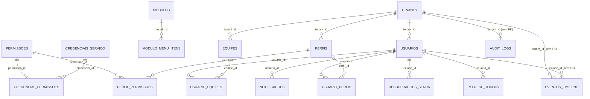

# MER/DER e Dicionário de Dados — schema `identity`

> Projeto Integrador 2026 · Grupo 2 — Plataforma e Controle de Usuários  
> Etapa **Banco de dados (Documentação)** da matriz de acompanhamento  
> Gerado em 25 de setembro de 2026 a partir das migrations `V1`, `V2` e `V3`, que são a fonte da verdade.

## 1. Como ler este documento

O sistema tem **um único banco PostgreSQL 16 com um schema por grupo** (Contrato de Integração §7.1). Este documento cobre o schema `identity`, do Grupo 2. Cada grupo documenta o seu da mesma forma.

Três regras explicam o desenho e valem para todos os schemas:

- **`tenant_id` em toda tabela de negócio**, desde a primeira migration, para o sistema atender várias empresas na mesma instalação (§6).
- **Nenhuma chave estrangeira atravessa schemas** (§7.1). Referência a dado de outro módulo é o UUID guardado sem FK, como `eventos_timeline.empresa_id`, que aponta para `crm.empresas`.
- **Exclusão é lógica**: `deleted_at` nulo significa ativo. Os índices únicos são parciais, com `WHERE deleted_at IS NULL`, para um nome liberado voltar a ser usado.

Três tabelas não têm `tenant_id` de propósito, porque descrevem a instalação e não uma empresa: `permissoes` (catálogo global), `modulos` e `credenciais_servico`.

## 2. Diagrama entidade-relacionamento

As três últimas linhas são relações por valor, sem chave estrangeira: a auditoria e a timeline aceitam registro de tenant já excluído e de usuário anônimo, e por isso não podem depender de FK.

## 3. Dicionário de dados

19 tabelas, agrupadas por assunto.

### Identidade e acesso

#### `identity.tenants`

| Coluna | Tipo | Obrigatório | Regras e descrição |
|---|---|---|---|
| `id` | `uuid` | sim | chave primária |
| `razao_social` | `text` | sim |  |
| `nome_fantasia` | `text` | não |  |
| `cnpj` | `varchar(14)` | não | único · somente dígitos |
| `subdominio` | `varchar(63)` | não | único |
| `ativo` | `boolean` | sim | padrão true · desativar bloqueia o login de todos os usuários |
| `created_at` | `timestamptz` | sim | padrão now() |
| `updated_at` | `timestamptz` | sim | padrão now() |
| `deleted_at` | `timestamptz` | não |  |

#### `identity.usuarios`

| Coluna | Tipo | Obrigatório | Regras e descrição |
|---|---|---|---|
| `id` | `uuid` | sim | chave primária |
| `tenant_id` | `uuid` | sim | referencia `tenants` |
| `nome` | `text` | sim |  |
| `email` | `citext` | sim |  |
| `senha_hash` | `text` | não | BCrypt 12; nulo até o convite ser aceito |
| `mfa_ativo` | `boolean` | sim | padrão false |
| `mfa_secret` | `text` | não |  |
| `preferencia_tema` | `varchar(10)` | sim | padrão 'sistema' valores aceitos: claro, escuro, sistema |
| `ultimo_login_em` | `timestamptz` | não |  |
| `ativo` | `boolean` | sim | padrão true |
| `created_at` | `timestamptz` | sim | padrão now() |
| `updated_at` | `timestamptz` | sim | padrão now() |
| `deleted_at` | `timestamptz` | não |  |
| `created_by` | `uuid` | não |  |
| `updated_by` | `uuid` | não |  |
| `telefone` | `varchar(20)` | não | acrescentada na V3 (onda 2) |

Índices: `uk_usuarios_email` — único, `email` WHERE deleted_at IS NULL; `idx_usuarios_tenant` — `tenant_id` WHERE deleted_at IS NULL.

#### `identity.perfis`

| Coluna | Tipo | Obrigatório | Regras e descrição |
|---|---|---|---|
| `id` | `uuid` | sim | chave primária |
| `tenant_id` | `uuid` | sim | referencia `tenants` |
| `nome` | `text` | sim |  |
| `descricao` | `text` | não |  |
| `sistema` | `boolean` | sim | padrão false · os dez perfis iniciais; impede exclusão |
| `created_at` | `timestamptz` | sim | padrão now() |
| `updated_at` | `timestamptz` | sim | padrão now() |
| `deleted_at` | `timestamptz` | não |  |
| `created_by` | `uuid` | não |  |
| `updated_by` | `uuid` | não |  |

Índices: `uk_perfis_tenant_nome` — único, `tenant_id, nome` WHERE deleted_at IS NULL.

#### `identity.permissoes`

| Coluna | Tipo | Obrigatório | Regras e descrição |
|---|---|---|---|
| `id` | `uuid` | sim | chave primária |
| `codigo` | `text` | sim | único |
| `modulo` | `text` | sim |  |
| `recurso` | `text` | sim |  |
| `acao` | `text` | sim |  |
| `descricao` | `text` | sim |  |
| `perfis_padrao` | `text` | sim | [] padrão '{}' |
| `servicos` | `text` | sim | [] padrão '{}' |

Índices: `idx_permissoes_modulo` — `modulo`.

#### `identity.perfil_permissoes`

| Coluna | Tipo | Obrigatório | Regras e descrição |
|---|---|---|---|
| `perfil_id` | `uuid` | sim | referencia `perfis` (apaga em cascata) |
| `permissao_id` | `uuid` | sim | referencia `permissoes` |
| `(chave primária)` | `` | sim | chave primária (perfil_id, permissao_id) |

#### `identity.usuario_perfis`

| Coluna | Tipo | Obrigatório | Regras e descrição |
|---|---|---|---|
| `usuario_id` | `uuid` | sim | referencia `usuarios` (apaga em cascata) |
| `perfil_id` | `uuid` | sim | referencia `perfis` |
| `created_at` | `timestamptz` | sim | padrão now() |
| `(chave primária)` | `` | sim | chave primária (usuario_id, perfil_id) |

#### `identity.equipes`

| Coluna | Tipo | Obrigatório | Regras e descrição |
|---|---|---|---|
| `id` | `uuid` | sim | chave primária |
| `tenant_id` | `uuid` | sim | referencia `tenants` |
| `nome` | `text` | sim |  |
| `created_at` | `timestamptz` | sim | padrão now() |
| `updated_at` | `timestamptz` | sim | padrão now() |
| `deleted_at` | `timestamptz` | não |  |
| `created_by` | `uuid` | não |  |
| `updated_by` | `uuid` | não |  |

Índices: `uk_equipes_tenant_nome` — único, `tenant_id, nome` WHERE deleted_at IS NULL.

#### `identity.usuario_equipes`

| Coluna | Tipo | Obrigatório | Regras e descrição |
|---|---|---|---|
| `usuario_id` | `uuid` | sim | referencia `usuarios` (apaga em cascata) |
| `equipe_id` | `uuid` | sim | referencia `equipes` (apaga em cascata) |
| `lider` | `boolean` | sim | padrão false · quem enxerga a equipe inteira |
| `created_at` | `timestamptz` | sim | padrão now() |
| `(chave primária)` | `` | sim | chave primária (usuario_id, equipe_id) |

Índices: `idx_usuario_equipes_equipe` — `equipe_id`.

### Sessão e recuperação

#### `identity.refresh_tokens`

| Coluna | Tipo | Obrigatório | Regras e descrição |
|---|---|---|---|
| `id` | `uuid` | sim | chave primária |
| `usuario_id` | `uuid` | sim | referencia `usuarios` (apaga em cascata) |
| `token_hash` | `text` | sim | único |
| `expira_em` | `timestamptz` | sim | fim da sessão; a rotação não estende |
| `revogado_em` | `timestamptz` | não |  |
| `ip` | `inet` | não |  |
| `user_agent` | `text` | não |  |
| `created_at` | `timestamptz` | sim | padrão now() |
| `sessao_id` | `uuid` | não | acrescentada na V3 (onda 2) |
| `iniciada_em` | `timestamptz` | não | acrescentada na V3 (onda 2) |

Índices: `idx_refresh_usuario` — `usuario_id` WHERE revogado_em IS NULL; `idx_refresh_sessao` — `usuario_id, sessao_id` WHERE revogado_em IS NULL.

#### `identity.recuperacoes_senha`

| Coluna | Tipo | Obrigatório | Regras e descrição |
|---|---|---|---|
| `id` | `uuid` | sim | chave primária |
| `usuario_id` | `uuid` | sim | referencia `usuarios` (apaga em cascata) |
| `tipo` | `varchar(12)` | sim | valores aceitos: convite, recuperacao |
| `token_hash` | `text` | sim | único |
| `expira_em` | `timestamptz` | sim | 72 h no convite, 30 min na recuperação |
| `usado_em` | `timestamptz` | não |  |
| `created_at` | `timestamptz` | sim | padrão now() |

Índices: `idx_recuperacoes_usuario` — `usuario_id, created_at DESC`.

#### `identity.tentativas_login`

| Coluna | Tipo | Obrigatório | Regras e descrição |
|---|---|---|---|
| `id` | `uuid` | sim | chave primária |
| `email` | `citext` | sim |  |
| `ip` | `inet` | não |  |
| `sucesso` | `boolean` | sim |  |
| `created_at` | `timestamptz` | sim | padrão now() |

Índices: `idx_tentativas_email` — `email, created_at DESC` WHERE NOT sucesso; `idx_tentativas_ip` — `ip, created_at DESC` WHERE NOT sucesso.

### Registro de módulos

#### `identity.modulos`

| Coluna | Tipo | Obrigatório | Regras e descrição |
|---|---|---|---|
| `id` | `uuid` | sim | chave primária |
| `codigo` | `varchar(30)` | sim | único · imutável |
| `nome` | `text` | sim |  |
| `grupo` | `text` | não |  |
| `icone` | `text` | não | nome de ícone do lucide, em kebab-case |
| `url_frontend` | `text` | sim | caminho na mesma origem: /modulos/crm/ |
| `prefixo_api` | `text` | sim |  |
| `permissao_menu` | `text` | sim |  |
| `ordem_menu` | `integer` | sim | padrão 100 |
| `healthcheck` | `text` | sim |  |
| `ativo` | `boolean` | sim | padrão true · desligar esconde o módulo sem apagar o registro |
| `created_at` | `timestamptz` | sim | padrão now() |
| `updated_at` | `timestamptz` | sim | padrão now() |

#### `identity.modulo_menu_itens`

| Coluna | Tipo | Obrigatório | Regras e descrição |
|---|---|---|---|
| `id` | `uuid` | sim | chave primária |
| `modulo_id` | `uuid` | sim | referencia `modulos` (apaga em cascata) |
| `rota` | `text` | sim |  |
| `nome` | `text` | sim |  |
| `permissao` | `text` | sim |  |
| `ordem` | `integer` | sim |  |

Índices: `idx_menu_itens_modulo` — `modulo_id, ordem`.

### Token de serviço

#### `identity.credenciais_servico`

| Coluna | Tipo | Obrigatório | Regras e descrição |
|---|---|---|---|
| `id` | `uuid` | sim | chave primária |
| `client_id` | `varchar(30)` | sim | único |
| `client_secret_hash` | `text` | sim |  |
| `modulo_codigo` | `varchar(30)` | sim |  |
| `ativo` | `boolean` | sim | padrão true |
| `created_at` | `timestamptz` | sim | padrão now() |
| `updated_at` | `timestamptz` | sim | padrão now() |

#### `identity.credencial_permissoes`

| Coluna | Tipo | Obrigatório | Regras e descrição |
|---|---|---|---|
| `credencial_id` | `uuid` | sim | referencia `credenciais_servico` (apaga em cascata) |
| `permissao_id` | `uuid` | sim | referencia `permissoes` |
| `(chave primária)` | `` | sim | chave primária (credencial_id, permissao_id) |

### Serviços transversais

#### `identity.audit_logs`

| Coluna | Tipo | Obrigatório | Regras e descrição |
|---|---|---|---|
| `id` | `uuid` | sim | chave primária |
| `tenant_id` | `uuid` | não | nulo: e-mail inexistente, token de serviço |
| `usuario_id` | `uuid` | não |  |
| `ip` | `inet` | não |  |
| `acao` | `text` | sim |  |
| `entidade` | `text` | sim |  |
| `entidade_id` | `uuid` | não |  |
| `valor_anterior` | `jsonb` | não |  |
| `valor_novo` | `jsonb` | não |  |
| `created_at` | `timestamptz` | sim | padrão now() |

Índices: `idx_audit_tenant_data` — `tenant_id, created_at DESC`; `idx_audit_entidade` — `entidade, entidade_id`.

#### `identity.eventos_timeline`

| Coluna | Tipo | Obrigatório | Regras e descrição |
|---|---|---|---|
| `id` | `uuid` | sim | chave primária |
| `tenant_id` | `uuid` | sim |  |
| `empresa_id` | `uuid` | sim | crm.empresas, sem FK entre schemas |
| `modulo_origem` | `varchar(30)` | sim |  |
| `tipo` | `text` | sim |  |
| `texto` | `text` | sim |  |
| `rota` | `text` | não |  |
| `usuario_id` | `uuid` | não |  |
| `ocorrido_em` | `timestamptz` | sim | quando o fato aconteceu, não quando foi gravado |
| `created_at` | `timestamptz` | sim | padrão now() |

Índices: `idx_timeline_empresa` — `tenant_id, empresa_id, ocorrido_em DESC`.

#### `identity.notificacoes`

| Coluna | Tipo | Obrigatório | Regras e descrição |
|---|---|---|---|
| `id` | `uuid` | sim | chave primária |
| `tenant_id` | `uuid` | sim |  |
| `usuario_id` | `uuid` | sim | referencia `usuarios` (apaga em cascata) |
| `categoria` | `text` | sim |  |
| `titulo` | `text` | sim |  |
| `texto` | `text` | não |  |
| `rota` | `text` | não |  |
| `lida_em` | `timestamptz` | não |  |
| `created_at` | `timestamptz` | sim | padrão now() |

Índices: `idx_notificacoes_usuario` — `tenant_id, usuario_id, created_at DESC`.

#### `identity.eventos_processados`

| Coluna | Tipo | Obrigatório | Regras e descrição |
|---|---|---|---|
| `evento_id` | `uuid` | sim | chave primária · o "id" do envelope da mensagem |
| `tipo` | `text` | sim |  |
| `processado_em` | `timestamptz` | sim | padrão now() |

## 4. Decisões de modelagem que valem registro

- **E-mail único global entre usuários não excluídos** (decisão D8). Índice único parcial em `usuarios(email)`, com o tipo `citext`, que compara sem diferenciar maiúsculas de minúsculas.
- **A auditoria só aceita inserção.** A migration revoga `UPDATE`, `DELETE` e `TRUNCATE` de `audit_logs` do usuário da aplicação. Como as migrations rodam com `own_identity` e a aplicação com `usr_identity`, a restrição é do banco, não um combinado.
- **O refresh token nunca é gravado.** A tabela guarda o SHA-256 do valor que vai no cookie; a rotação cria uma linha nova e revoga a anterior, mantendo `sessao_id` e `iniciada_em` para a sessão sobreviver às renovações.
- **`eventos_processados` garante idempotência** no consumo de mensagens: o `id` do envelope é gravado na mesma transação do efeito, então a mesma mensagem entregue duas vezes produz um efeito só (Contrato §9.7).
- **`tentativas_login` sustenta o bloqueio** de 5 falhas em 15 minutos por e-mail ou por IP, com índices parciais só sobre as falhas.

## 5. Desvios do Modelo de Dados v0.2, a registrar na v0.3

| Onde | O quê | Por quê |
|---|---|---|
| `permissoes.perfis_padrao` | array de perfis | recebe o campo `perfisPadrao` da lista de permissões de cada grupo, para um perfil novo já nascer com as permissões certas |
| `permissoes.servicos` | array de `clientId` | diz quais credenciais de serviço recebem a permissão (Contrato §9.2) |
| `modulos.grupo` | texto | vem do registro `modulos/{codigo}.json` e aparece na administração |
| `usuarios.telefone` | `varchar(20)` | pedido pelo requisito RF13 |
| `refresh_tokens.sessao_id` e `iniciada_em` | `uuid` e `timestamptz` | a rotação grava uma linha por renovação; a sessão precisa de identificador próprio (RF06) |

---

Fonte: `plataforma-integrador-2026-2/identity/src/main/resources/db/migration/`. Este documento é gerado a partir das migrations — ao mudar o banco, gere de novo.